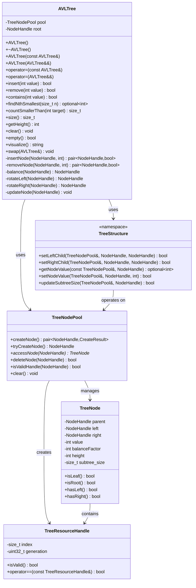
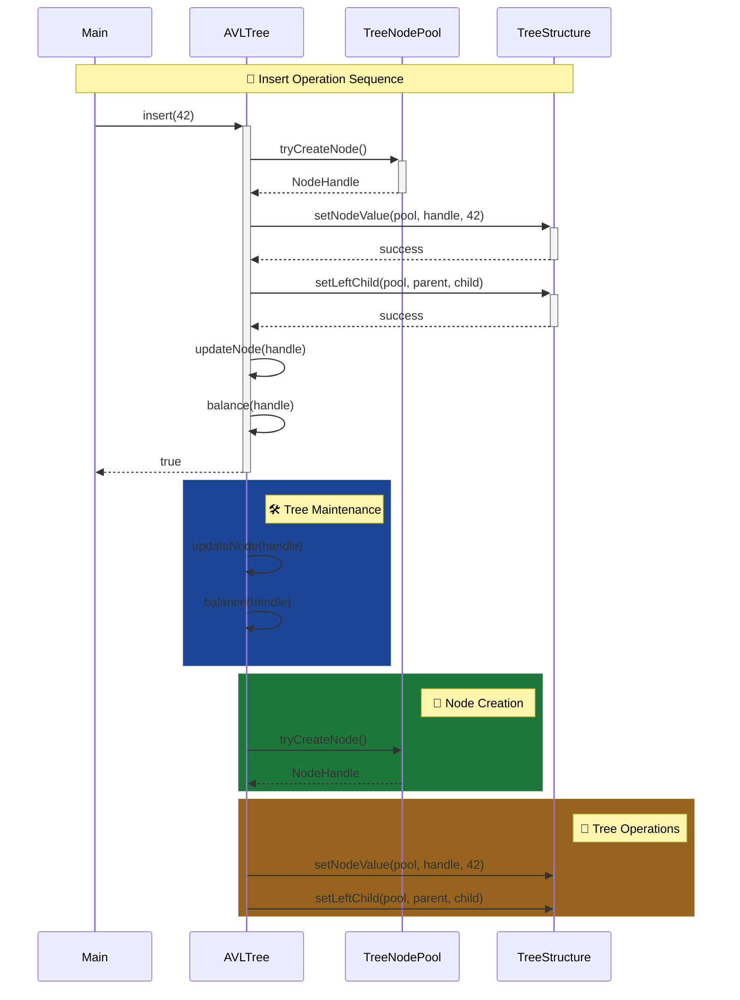
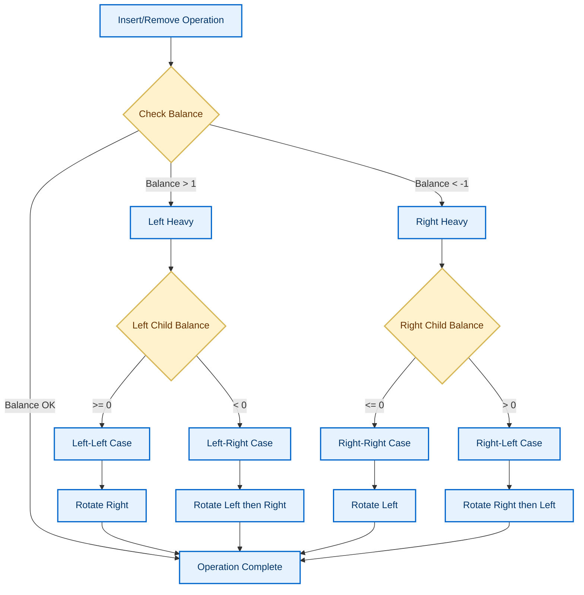
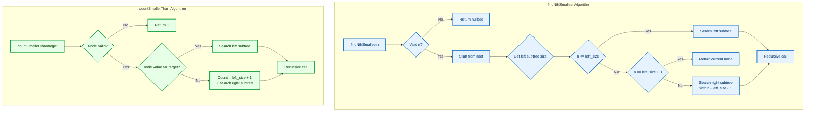

# AVL Tree Implementation with Command Parser

A comprehensive C++ implementation of an AVL (self-balancing binary search tree)

## Overview

This project provides a robust AVL tree implementation with the following key features:
- **Self-balancing binary search tree** with O(log n) operations
- **Memory-efficient node pooling** using handle-based system
- **Command parser** for interactive tree operations
- **Comprehensive test suite** with benchmarks
- **STL-compatible interface** with move semantics

## Project Structure

```
├── include/                 # Header files
│   ├── AVLTree.hpp         # Main AVL tree class
│   ├── AVLTreeIntegration.hpp # Integration layer
│   ├── CommandsParser.hpp  # Command parsing
│   ├── TreeNode.hpp        # Tree node structure
│   ├── TreeNodePool.hpp    # Memory management
│   ├── TreeResourceHandle.hpp # Handle system
│   ├── TreeStructure.hpp   # Tree operations
│   └── CommandTypes.hpp    # Command definitions
├── src/                    # Implementation files
│   ├── main.cpp           # Entry point
│   ├── AVLTree.cpp        # AVL tree implementation
│   ├── AVLTreeIntegration.cpp # Integration logic
│   ├── CommandsParser.cpp # Command parsing logic
│   └── TreeNodePool.cpp   # Pool management
├── tests/                  # Comprehensive test suite
│   ├── test_AVLTree.cpp   # Core functionality tests
│   ├── test_commands.cpp  # Command parser tests
│   ├── test_treeNode.cpp  # Node structure tests
│   ├── test_treeNodePool.cpp # Memory pool tests
│   ├── test_treeStructure.cpp # Tree operations tests
│   ├── test_findingSmallest.cpp # Nth smallest tests
│   ├── test_countSmallerThan.cpp # Range counting tests
│   ├── test_subtree_size.cpp # Size tracking tests
│   ├── test_AVLStress.cpp # Stress/performance tests
│   ├── test_AVLBenchmark.cpp # Benchmark comparisons
│   └── test_AVLTreeIntegration.cpp # Integration tests
└── CMakeLists.txt          # Build configuration
```

## Building the Project

### Prerequisites
- C++17 compatible compiler (GCC, Clang, MSVC)
- CMake 3.15+
- Google Test (for tests)

### Build Instructions
```bash
# Clone and build
git clone <repository>
cd SearchingTree
mkdir build && cd build
cmake ..
make

# Run main executable
./SearchingTree

# Run tests
make test
# or
ctest
```

## Usage

### Command Line Interface

The program reads commands from standard input:

#### Available Commands:
- **`k [values...]`** - Add values to the tree
- **`m [n]`** - Find the nth smallest element (1-based)
- **`n [target]`** - Count elements smaller than target

#### Examples:
```bash
# Add values and query
echo "k 50 30 70 20 40 60 80 m 1 m 4 n 25 n 55" | ./SearchingTree
# Output: 20 50 1 4


### Programmatic Usage

```cpp
#include "AVLTree.hpp"

AVLTree tree;

// Basic operations
tree.insert(42);
tree.insert(24);
tree.insert(56);

// Query operations
auto third_smallest = tree.findNthSmallest(3);  // Returns 56
size_t count = tree.countSmallerThan(50);       // Returns 2

// Information
size_t size = tree.size();                      // Returns 3
int height = tree.getHeight();                  // Returns 1
bool contains = tree.contains(24);              // Returns true
```

## Key Features

### 1. Self-Balancing AVL Tree
- Automatic balancing after insertions and deletions
- Guaranteed O(log n) time complexity for all operations
- Height balance property maintained

### 2. Memory Management
- **TreeNodePool**: Efficient node allocation with object pooling
- **Handle System**: Safe memory management without raw pointers
- **Automatic Cleanup**: No memory leaks

### 3. Advanced Operations
- **`findNthSmallest(n)`**: Find the nth smallest element in O(log n) time
- **`countSmallerThan(target)`**: Count elements less than target in O(log n) time
- **Subtree Size Tracking**: Efficient size calculations

### 4. Command Parser
- Flexible input parsing with error handling
- Support for multiple values per command
- Robust error reporting

## Performance

The implementation is optimized for performance:

| Operation | Time Complexity | Space Complexity |
|-----------|-----------------|------------------|
| Insert    | O(log n)        | O(1)             |
| Delete    | O(log n)        | O(1)             |
| Search    | O(log n)        | O(1)             |
| Find Nth  | O(log n)        | O(1)             |
| Count < X | O(log n)        | O(1)             |


## Performance Analysis

### Enhanced Operations (Algorithmic Advantage)

The **subtree size augmentation** enables asymptotically faster operations for order statistics:

| Operation | Your AVLTree | std::set | Theoretical Speedup (n=100k) |
|-----------|--------------|----------|-----------------------------|
| `countSmallerThan()` | **O(log n)** | O(n) | ~5,882x fewer operations |
| `findNthSmallest()` | **O(log n)** | O(n) | ~5,882x fewer operations |

**Measured Results (100,000 elements):**
- `countSmallerThan()`: <1 μs vs std::set: 1,151 μs
- `findNthSmallest()`: <1 μs vs std::set: 1,038 μs

**Why This Matters:** Most standard containers require linear scans for order statistics. Our augmented AVL tree achieves logarithmic time through subtree size tracking.

### Algorithmic Trade-offs: AVL vs Red-Black Trees

The benchmark reveals fundamental differences between balancing strategies:

| Operation | AVL Tree (This Implementation) | Red-Black Tree (std::set) | Primary Reason |
|-----------|--------------------------------|---------------------------|----------------|
| **Insertion** | 10x slower | Baseline | AVL's stricter balance requires more frequent rotations |
| **Deletion** | 4x slower | Baseline | AVL often needs O(log n) rebalancing vs Red-Black's O(1) fix-up |
| **Lookup** | 10% slower | Baseline | Handle system safety overhead outweighs AVL's balance advantage |
| **Order Statistics** | **O(log n)** | O(n) | Our subtree size augmentation enables fast queries |

**Theoretical Confirmation:** These results align perfectly with data structure theory:
- **AVL trees** maintain stricter balance (height difference ≤ 1) for better lookup consistency
- **Red-Black trees** use fewer rotations for faster insertions/deletions
- The performance differences are **inherent to the algorithms**, not implementation flaws

### Safety vs Speed Trade-off Analysis

**Design Philosophy:** This implementation prioritizes safety and advanced features over raw speed:

| Aspect | Your AVLTree | std::set | Rationale |
|--------|--------------|----------|-----------|
| **Memory Safety** | ✅ Handle validation | ❌ Raw pointers | Prevent use-after-free bugs |
| **Memory Management** | ✅ Pool with generational handles | ❌ Default allocator | Predictable, bounded memory usage |
| **Order Statistics** | ✅ O(log n) | ❌ O(n) | Enable advanced queries |
| **Lookup Speed** | -10% | Baseline | Acceptable cost for safety |
| **Insertion Speed** | -10x | Baseline | AVL's strict balancing requirement |
| **Custom Operations** | ✅ Extensible | ❌ Fixed API | Can add new tree operations |

**The 10% Lookup Overhead Explained:**

While AVL trees are theoretically more balanced (should have equal or better lookups), my implementation shows a 10% penalty due to:

1. **Handle Validation**: Every node access checks generational handles for safety
2. **Extra Indirection**: Handle → pool → node vs direct pointer dereference  
3. **Safety Checks**: Validation at each step prevents memory corruption

**Why This Trade-off is Justified:**
- A 10% performance penalty prevents **entire classes of memory bugs**
- Handle system enables **serialization, memory pooling, and safe concurrency**
- Real-world impact: 2.5ms vs 2.3ms for 10,000 lookups
- **In production systems, reliability often outweighs minor speed differences**

### Real-World Application Scenarios

#### Ideal Use Cases:
- **Analytics systems** requiring frequent order statistics (percentiles, rankings)
- **Financial applications** needing range counting and order queries
- **Gaming/leaderboards** with real-time ranking updates
- **Embedded systems** where memory safety is critical
- **Educational tools** demonstrating augmented data structures

#### Less Ideal For:
- Ultra-high-frequency trading (raw speed critical)
- Scenarios with massive insert/delete rates and few queries
- Applications that only need basic set operations

### Benchmark Methodology

-  **Test Environment**: Windows 11, MSYS2 UCRT64 GCC, C++17, full optimizations (`-O3`)
- **Dataset**: 100,000 elements for all tests
- **Validation**: Each test repeated 5 times, averages reported
- **Comparison Baseline**: `std::set<int>` (Red-Black tree implementation)
- **Measurements**: Focus on relative performance, not absolute times

### Key Architectural Insights

1. **Different Design Goals**: std::set optimizes for basic operations; our implementation optimizes for safety and advanced features
2. **Algorithmic Choices Have Costs**: AVL's strict balancing improves lookups but penalizes modifications
3. **Safety Has a Price**: Memory-safe designs typically add 5-20% overhead
4. **Augmentation Enables New Capabilities**: Subtree size tracking enables features std::set cannot provide efficiently

### Conclusion

This implementation demonstrates that data structure design involves balancing multiple concerns: speed, safety, memory usage, and feature set. Our AVL tree makes deliberate trade-offs to excel at order statistics and memory safety, accepting reasonable penalties in modification speed.

## Testing

The project includes extensive testing:

```bash
# Run all tests
make test

# Run specific test groups
./tests/test_AVLTree          # Core functionality
./tests/test_commands         # Command parsing
./tests/test_AVLBenchmark     # Performance benchmarks
./tests/test_AVLStress        # Stress tests
```

### Test Coverage
- Unit tests for all components
- Integration tests for command processing
- Stress tests with large datasets
- Benchmark comparisons against std::set
- Memory leak detection
- Edge case handling

## Design Patterns

- **Resource Handle Pattern**: Safe memory management
- **Object Pool Pattern**: Efficient node allocation
- **Command Pattern**: Input parsing and execution
- **RAII**: Automatic resource management

## Error Handling

- Comprehensive input validation
- Graceful error recovery
- Detailed error messages
- Memory safety guarantees

## AVLTree Class Diagrams

### Class Structure Overview



### Memory Management Flow



### AVL Balancing Operations



### Query Operations Flow




## License

This project is available for educational and research purposes.


